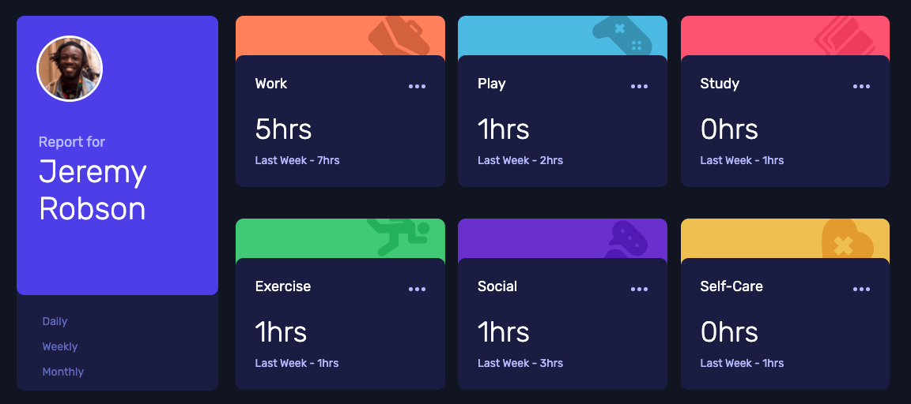

# Time Tracking Dashboard Challange
I completed the Frontend Mentor Time Tracking Dashboard challenge. I spent more time and effort here than I had planned. Especially the layout of the cards slowed me down because I wanted to work on display: flex. In this process, I gained experience in flexbox, responsive design, javascript and writing the data from the object into html and applying css.

## Table Of Contents
- [Overview](#overview)
- [Screenshot](#screenshot)
- [Links](#links)
- [My Process](#my-process)
- [What I Learned](#what-I-learned)

## Overview
The application I have made uses the data saved as general json to display daily, weekly and monthly. It shows the interaction in case of hovering over the cards.

## Screenshot


## Links
- Solution URL: [Github](https://github.com/smhmurat/frontend-mentor-tt-dashboard.git)
- Live Site URL: [Website](https://frontend-mentor-tt-dashboard-iv9vedniz-smhmurat.vercel.app/)

## My Process
I used very little html code in the project. I did the creation of the cards showing the data with the codes I wrote with JavaScript. By adding dynamic class names to each card, I set the styles on the CSS side. I have worked a lot, especially on flexbox.

## What I Learned
Below are the JavaScript codes for dynamically creating cards and giving dynamic class names. 👇
```js
let createCard = (item, time) => {
  let card = `
  <div class="report__item ${item.title.toLowerCase()}">
    <div class="report__item-content">
      <div class="report__item-content-top">
        <p>${item.title}</p>
        <a href="#">
          </img>
        </a>
      </div>
      <div class="report__item-content-bottom">
        <h1>${time.current}hrs</h1>
        <p class="info">Last Week - ${time.previous}hrs</p>
      </div>
    </div>
  </div>
  `

  return card;
}
```

Codes of links that provide daily, weekly and monthly transitions 👇
````js
function showDaily() {
  let allItems = " ";
  data.map(item => {
    if(item.timeframes.daily) {
      allItems += createCard(item, item.timeframes.daily);
    }
  });
  cardReport.innerHTML = allItems;
}

function showWeekly() {
  let allItems = " ";
  data.map(item => {
    if(item.timeframes.weekly) {
      allItems += createCard(item, item.timeframes.weekly)
    }
  });
  cardReport.innerHTML = allItems;
}

function showMonthly() {
  let allItems = " ";
  data.map(item => {
    if(item.timeframes.monthly) {
      allItems += createCard(item, item.timeframes.monthly)
    }
  });
  cardReport.innerHTML = allItems;
}

showDaily();

const linkDaily = document.querySelector("#daily").addEventListener("click", showDaily);
const linkWeekly = document.querySelector("#weekly").addEventListener("click", showWeekly);
const linkMonthly = document.querySelector("#monthly").addEventListener("click", showMonthly);
````

## Continued Development
I wanted to develop the project first using React and Tailwind. However, I only used JavaScript to gain more experience, especially with JavaScript. I may recode the project with React in the future.

## Useful Resources
- [Frontend Masters](https://frontendmasters.com/)
- [CSS Tricks](https://css-tricks.com/)
- [Codepen](https://codepen.io/)


## Author
- [Frontend Mentor](https://www.frontendmentor.io/profile/smhmurat)
- [Twitter](https://twitter.com/smhmurat)
- [Linkedin](https://www.linkedin.com/in/smhmurat/)

## Acknowledgments
I would like to thank my mentor, Mustafa Yeşilbaş, who helped me a lot when I got stuck in the project.